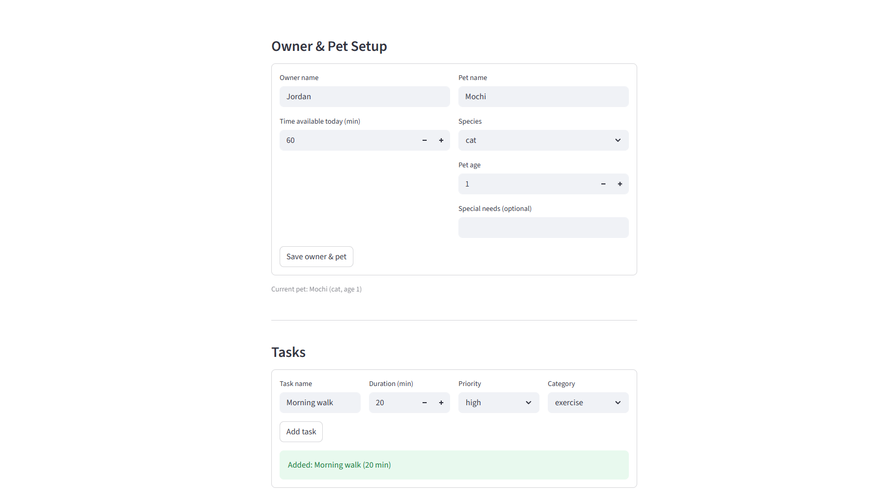

# PawPal+ (Module 2 Project)

You are building **PawPal+**, a Streamlit app that helps a pet owner plan care tasks for their pet.

## 📸 Demo

<a href="Capture_streamlit_app_demo.PNG" target="_blank"></a>

## Scenario

A busy pet owner needs help staying consistent with pet care. They want an assistant that can:

- Track pet care tasks (walks, feeding, meds, enrichment, grooming, etc.)
- Consider constraints (time available, priority, owner preferences)
- Produce a daily plan and explain why it chose that plan

Your job is to design the system first (UML), then implement the logic in Python, then connect it to the Streamlit UI.

## What you will build

Your final app should:

- Let a user enter basic owner + pet info
- Let a user add/edit tasks (duration + priority at minimum)
- Generate a daily schedule/plan based on constraints and priorities
- Display the plan clearly (and ideally explain the reasoning)
- Include tests for the most important scheduling behaviors

## Features

- **Priority-based scheduling** — the scheduler sorts all pending tasks by priority (1–5) and greedily fills the owner's time budget highest-first, so critical care always fits before lower-priority tasks are considered.
- **Time budget enforcement** — tasks that would exceed the remaining available minutes are skipped and surfaced in a "Skipped tasks" panel in the UI, so the owner always sees what didn't make the cut and why.
- **Chronological sorting** — the daily plan is displayed in ascending start-time order (`HH:MM`), giving the owner a readable, time-ordered view of their day rather than a priority-ranked list.
- **Conflict detection** — after a plan is generated, the scheduler groups tasks by their scheduled time slot and flags any slot containing more than one task, naming each conflicting task so the owner knows exactly what to reschedule.
- **Daily and weekly recurrence** — marking a task complete automatically creates the next occurrence: `daily` tasks advance by one day, `weekly` tasks by seven days. One-off tasks produce no follow-up.
- **Per-pet task filtering** — tasks can be filtered by pet name (case-insensitive) or completion status, supporting owners who manage care for more than one animal.
- **Plan explanation** — a plain-language summary shows how many tasks were scheduled, how many minutes were used out of the available budget, and which tasks were skipped, giving the owner full visibility into the scheduling decisions.
- **Urgency-aware composite scoring** — instead of sorting by raw priority alone, the scheduler computes a composite score per task: `score = (priority × priority_weight) + (urgency × urgency_weight) + category_boost`. Urgency is derived from `due_date` proximity (overdue = 6.0, due today = 5.0, …, 7+ days = 0.0). Medication tasks receive a +2.0 category boost and feeding tasks a +1.0 boost. Both weights are tunable via sliders (0.0–2.0) in the UI, and each scheduled task's score is shown in the plan table alongside a due-date annotation (`[DUE TODAY]`, `[OVERDUE]`, etc.).

## Getting started

### Setup

```bash
python -m venv .venv
source .venv/bin/activate  # Windows: .venv\Scripts\activate
pip install -r requirements.txt
```

### Suggested workflow

1. Read the scenario carefully and identify requirements and edge cases.
2. Draft a UML diagram (classes, attributes, methods, relationships).
3. Convert UML into Python class stubs (no logic yet).
4. Implement scheduling logic in small increments.
5. Add tests to verify key behaviors.
6. Connect your logic to the Streamlit UI in `app.py`.
7. Refine UML so it matches what you actually built.

## Testing PawPal+

Run the full test suite from the project root:

```bash
python -m pytest tests/test_pawpal.py -v
```

### What the tests cover

| Area                    | Tests | Description                                                                                                                                                                                                                                                                            |
| ----------------------- | ----- | -------------------------------------------------------------------------------------------------------------------------------------------------------------------------------------------------------------------------------------------------------------------------------------- |
| **Schedule generation** | 5     | Verifies tasks are ordered by descending priority, the time budget is enforced, completed tasks are excluded, and edge cases (zero budget, no tasks) produce empty plans without crashing.                                                                                             |
| **Recurrence logic**    | 4     | Confirms that completing a `daily` task creates a new task due the next day, a `weekly` task advances by 7 days, a `"once"` task returns `None`, and the owner's task list actually grows after recurrence.                                                                            |
| **Conflict detection**  | 3     | Checks that two tasks sharing the same `HH:MM` slot produce a warning naming both tasks, distinct slots produce no warnings, and tasks with no scheduled time are silently ignored.                                                                                                    |
| **Sorting correctness** | 2     | Validates that `sort_by_time` returns tasks in ascending chronological order, and verifies that tasks with no `time` set sort last without crashing (the prior `IndexError` bug is fixed).                                                                                             |
| **Composite scoring**   | 6     | Covers `score_task` with no due date, medication category boost, overdue task outranking a higher-priority non-urgent task, `priority_weight=0` making scheduling purely urgency-driven, the full urgency ladder (overdue/today/1d/3d/6d/8d), and feeding vs. exercise category boost. |

### Confidence level

**4 / 5 stars**

All 22 tests pass. The core scheduling logic (priority ordering, time budget, recurrence date math, conflict grouping) and the new composite scoring algorithm are well-covered. Confidence is held back by:

1. **No UI-layer tests** — the Streamlit front-end in `app.py` is untested; user-input paths and session-state interactions are not verified.
2. **`date.today()` not mocked** — the fallback branch in `mark_task_complete` (when `due_date=None`) is tested indirectly at best; a clock-dependent test could produce inconsistent results on different days.

The previously documented `sort_by_time` crash on empty `time` strings has been fixed.

# Stretch Features (Optional Challenges)

Checklist:

- [x] Challenge 1: Advanced Algorithmic Capability via Agent Mode
- [x] Challenge 2: Data Persistence with Agent Mode
- [x] Challenge 3: Advanced Priority Scheduling and UI
- [x] Challenge 4: Professional UI and Output Formatting
- [ ] Challenge 5: Multi-Model Prompt Comparison

## Challenge 1: Advanced Algorithmic Capability via Agent Mode

### Agent Mode: How the composite scoring feature was implemented

The urgency-aware composite scoring feature was implemented end-to-end using **Claude Code's Agent Mode** (Edit Automatically), which allows the AI to read, plan, and edit files directly without requiring manual copy-paste of code.

### What Agent Mode did

**1. Codebase exploration (read-only)**

Before writing a single line, Agent Mode launched parallel sub-agents to read every relevant file — `pawpal_system.py`, `app.py`, `tests/test_pawpal.py`, `main.py`, and `reflection.md`. This gave it a complete picture of: the existing data models (`Task`, `Owner`, `Scheduler`), which fields were already present but unused (`due_date`, `category`), the known `sort_by_time` bug, and all 16 existing tests. No code was written until the codebase was fully understood.

**2. Plan generation (plan mode)**

Agent Mode then entered Plan Mode — a read-only phase where it designed the implementation and wrote a plan file before making any edits. The plan identified:

- The exact lines to change in each file (e.g., line 64 of `pawpal_system.py` for the sort key)
- Which existing tests would be unaffected and why (tasks with no `due_date` score = priority × 1.0, preserving all existing sort orders)
- The 6 new test cases and their expected outputs
- A compatibility check showing that all 16 existing tests would continue to pass

The plan was reviewed and approved before any file was touched.

**3. Multi-file editing (edit automatically)**

After plan approval, Agent Mode executed all changes in a single coordinated pass across three files:

| File                   | Changes made                                                                                                                                                                                                                                                                                 |
| ---------------------- | -------------------------------------------------------------------------------------------------------------------------------------------------------------------------------------------------------------------------------------------------------------------------------------------- |
| `pawpal_system.py`     | Added `priority_weight`/`urgency_weight` params to `__init__`; added `_CATEGORY_BOOST` class attribute; added `score_task()` method; updated `generate_plan()` sort key; rewrote `sort_by_time()` to fix the empty-string crash; updated `explain()` to show scores and due-date annotations |
| `app.py`               | Added `due_date` and `time` inputs to the task form; added weight sliders before the schedule button; threaded weights into `Scheduler`; replaced the inline sort workaround with `scheduler.sort_by_time()`; added `Due` and `Score` columns to the plan table                              |
| `tests/test_pawpal.py` | Added `import pytest`; renamed and rewrote the bug-documenting test to assert the fixed behavior; added 6 new `score_task` tests                                                                                                                                                             |

**4. Test execution and verification**

Agent Mode ran `pytest tests/test_pawpal.py -v` after completing the edits and confirmed all 22 tests pass (16 original + 6 new).

### Why Agent Mode was effective here

- **No context switching** — the feature touched 3 files simultaneously; Agent Mode held the full plan in context and made all edits coherently rather than requiring the developer to manually apply each change.
- **Backward compatibility was reasoned about, not guessed** — Agent Mode explicitly checked that the new scoring formula produces identical results to the old priority-sort for any task with no `due_date` and a non-boosted category (score = priority × 1.0), so no existing test needed to be updated.
- **Bugs were fixed proactively** — the known `sort_by_time` crash was identified during exploration and fixed as part of the same edit pass, since both changes touched the same class.
- **The plan file served as a contract** — because edits only started after the plan was written and approved, there was a clear record of what was intended vs. what was executed, making it easy to verify the implementation matched the design.
