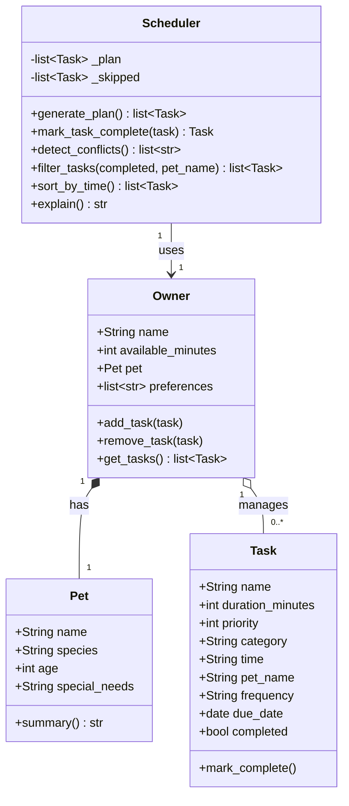

```mermaid
classDiagram
    class Owner {
        +String name
        +int available_minutes
        +Pet pet
        +list~str~ preferences
        +add_task(task)
        +remove_task(task)
        +get_tasks() list~Task~
    }

    class Pet {
        +String name
        +String species
        +int age
        +String special_needs
        +summary() str
    }

    class Task {
        +String name
        +int duration_minutes
        +int priority
        +String category
        +String time
        +String pet_name
        +String frequency
        +date due_date
        +bool completed
        +mark_complete()
    }

    class Scheduler {
        -list~Task~ _plan
        -list~Task~ _skipped
        +generate_plan() list~Task~
        +mark_task_complete(task) Task
        +detect_conflicts() list~str~
        +filter_tasks(completed, pet_name) list~Task~
        +sort_by_time() list~Task~
        +explain() str
    }

    Owner "1" *-- "1" Pet : has
    Owner "1" o-- "0..*" Task : manages
    Scheduler "1" --> "1" Owner : uses
```
