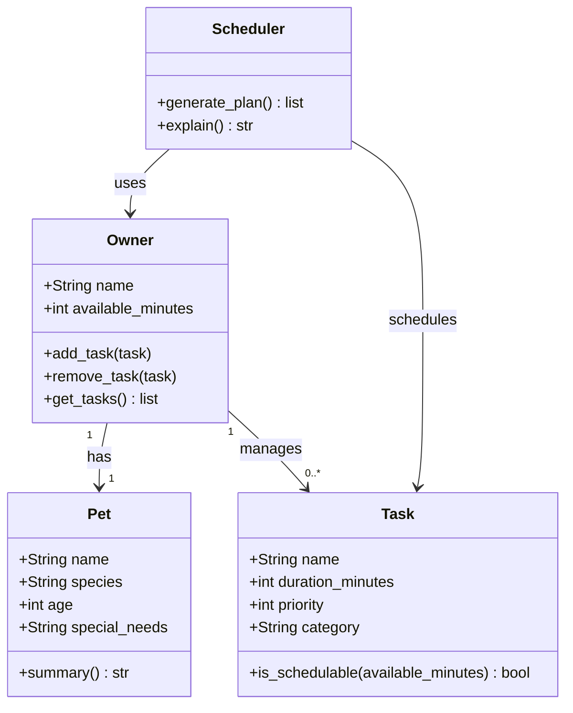

```mermaid
classDiagram
    class Owner {
        +String name
        +int available_minutes
        +add_task(task)
        +remove_task(task)
        +get_tasks() list
    }

    class Pet {
        +String name
        +String species
        +int age
        +String special_needs
        +summary() str
    }

    class Task {
        +String name
        +int duration_minutes
        +int priority
        +String category
        +is_schedulable(available_minutes) bool
    }

    class Scheduler {
        +generate_plan() list
        +explain() str
    }

    Owner "1" --> "1" Pet : has
    Owner "1" --> "0..*" Task : manages
    Scheduler --> Owner : uses
    Scheduler --> Task : schedules
```
